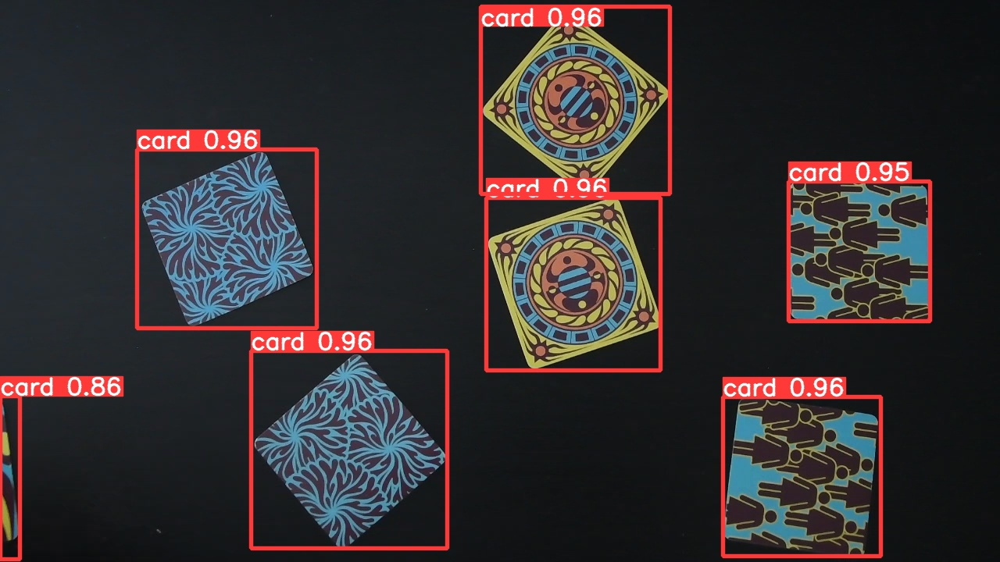
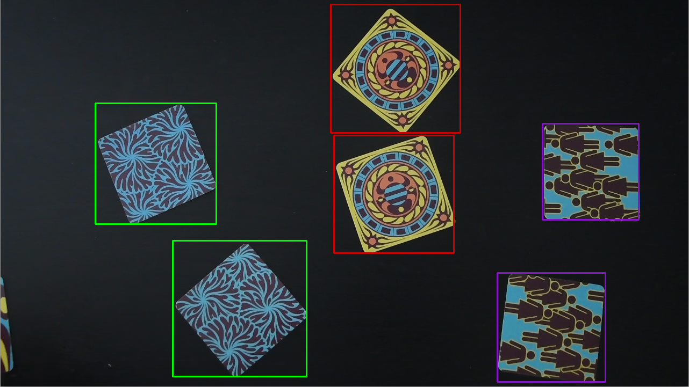

# Twibot

Here is my Twibot project.

The aim of this project is to make a bot able to play a game named Twinit using AI and some image processing techniques.

## What is Twinit?

Twinit is a game where the goal is to be the faster among your opponents to point out two identical cards. 
The cards are arranged on the table, visible to all. 

[Here](https://www.youtube.com/watch?v=-f1PxF9CDfU) is a detailled explanation of the game (in french).

## Steps of the project

I have broken down the project in two steps.

- Detect the cards
- Match identical cards

### Detect the cards

This step is the easiest one. It involves the training of an object detection model to detect the cards.
The longest part was to build a dataset and annotate a sufficient number of cards to fine tune a YOLO model.
I have limited the task to detect cards on a black background to make things easier.
Because the task is quite easy, I fine-tuned the smallest model of YOLOv5.

Here is an example of the twinit-cards detection model's output.

For train the model I used my NVIDIA 1060 GTX GPU. The inference is performed in 5 milliseconds. 

### Match identical cards

Match identical cards was the challenging step.
For this step I experimented a few methods, like morphological techniques, few-shot learning and 
key-point detector. I retained the key-point detector way because it was the fastest to run.

The method starts by making pairs of all cards that appears on the image.
Then, for each pair, we compute key points for both cards thanks to SIFT algorithm,
provided by the `sift` object of OpenCV.

The method returns a set of descriptor for each cards in the pair. We used this set as input of a matcher
algorithm based on fast nearest neighbor search. 
OpenCV provide this especially with the `cv2.FlannBasedMatcher` function.

Based on the number of descriptor matched, we can determine if two cards are identical or not. 
For this, we set a threshold on the number of matches, from which we consider two cards identical.

Here is an example of the result.

